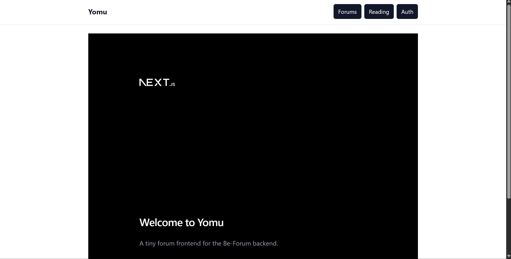
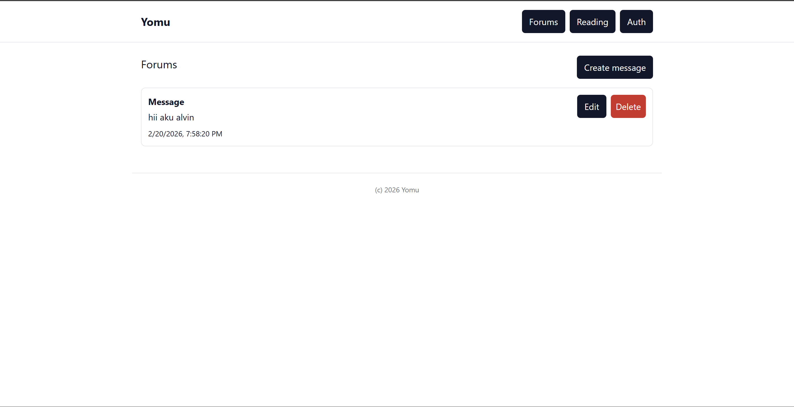

# be-forum

## Deployment

Copy .env.example to .env, then fill in with the appropriate values

```bash
docker compose up --build -d
```
Note: This is only the backend. Frontend can be accessed on https://github.com/advprog-2026-A11-project/fe-yomu

## Frontend, Backend, Database integration




The database image is persistant, you can test this by doing 

```bash
docker compose down
```
then 
```bash
docker compose up -d
```
