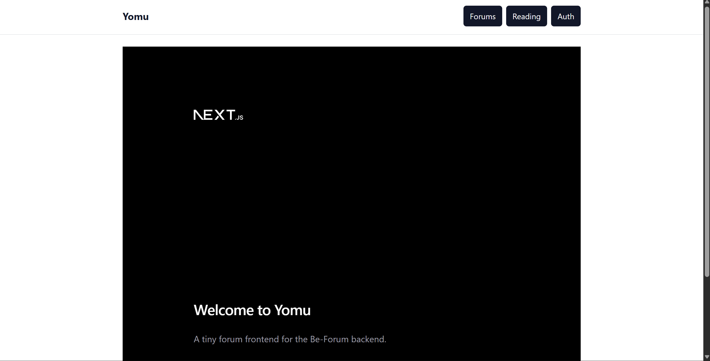
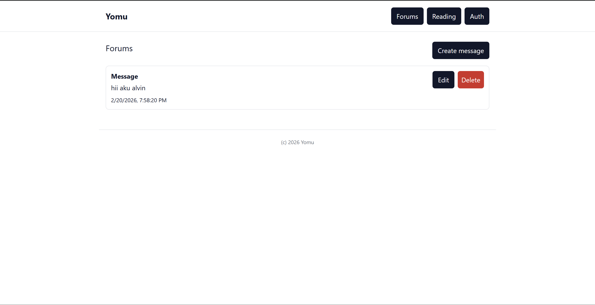

# be-forum

## Deployment

Copy .env.example to .env, then fill in with the appropriate values

Required auth integration env:
- `AUTH_BACKEND_URL` (example: `http://localhost:8081`)
- `SUPABASE_URL` (example: `https://<project-ref>.supabase.co`)

Required monitoring env:
- `OTEL_EXPORTER_OTLP_ENDPOINT` (example: `http://<monitoring-host>:4318`)
- `OTEL_LOGS_ENDPOINT` (example: `http://<monitoring-host>:4318/v1/logs`)

Write operations (`POST`/`PUT`/`DELETE`) on `/api/messages`
and `/api/messages/{messageId}/reactions` require
a Supabase Bearer access token. The backend verifies the token against
`<SUPABASE_URL>/auth/v1/.well-known/jwks.json`, reads user id from `yomu_user_id`, stores that
id on create, allows update only when the token user matches the owner, and allows delete for
owners or users with `user_role=ADMIN`.

```bash
docker compose up --build -d
```

`docker-compose.yml` and `docker-compose.dev.yml` include a `log-shipper` service that tails Docker
container logs and forwards be-forum log lines (containing `trace_id=`) to the configured OTLP HTTP
endpoint. This keeps logs visible in Grafana/Loki/Drilldown across deployments.

Note: This is only the backend. Frontend can be accessed on https://github.com/advprog-2026-A11-project/fe-yomu

## Frontend, Backend, Database integration




The database image is persistant, you can test this by doing

```bash
docker compose down
```

then

```bash
docker compose up -d
```
